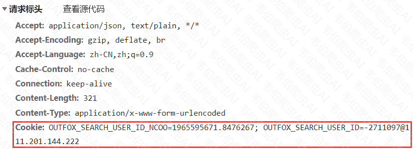
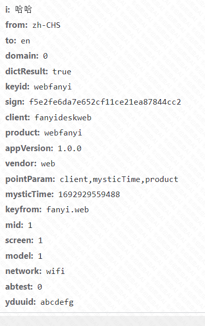
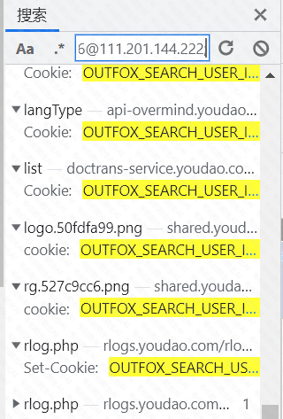
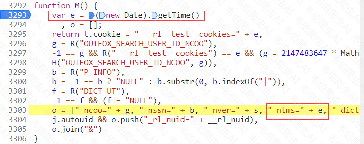
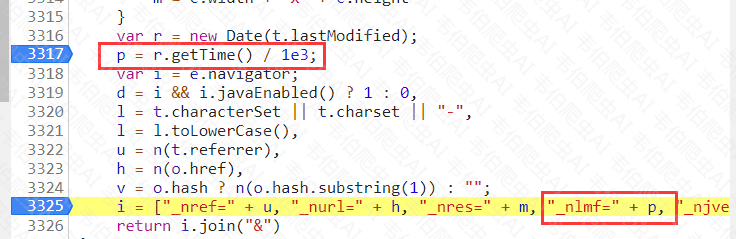
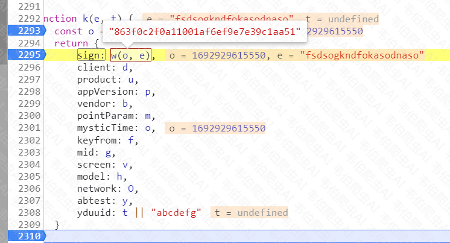
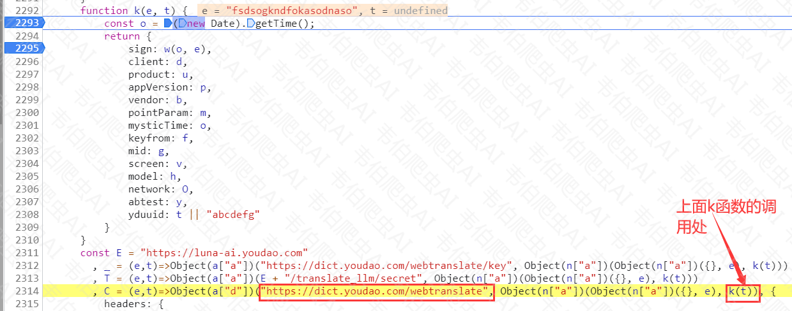
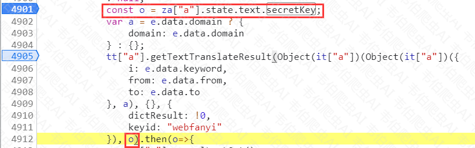
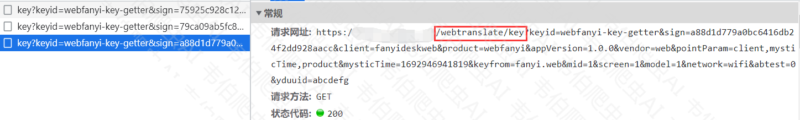

# 声明

本文章中所有内容仅供学习交流，抓包内容、敏感网址、数据接口均已做脱敏处理，严禁用于商业用途和非法用途，否则由此产生的一切后果均与作者无关，若有侵权，请联系我立即删除！

# 逆向目标

- 目标：有道翻译接口
- 接口：`aHR0cHM6Ly9kaWN0LnlvdWRhby5jb20vd2VidHJhbnNsYXRl`

# 抓包分析

`webtranslate`接口请求携带参数：

请求头：



post请求参数：



# 参数分析

## cookie

> 经过测试发现，请求头中的cookie参数必须携带。

此处cookie格式：

- OUTFOX_SEARCH_USER_ID_NCOO=1965595671.8476267; 
- OUTFOX_SEARCH_USER_ID=-1564989656@111.201.144.222;

### OUTFOX_SEARCH_USER_ID_NCOO

通过hook操作即可很快定位到`OUTFOX_SEARCH_USER_ID_NCOO`的生成处。

hook代码：

```js
(function(){
    var _cookie = "";
    Object.defineProperty(document, 'cookie', {
        set: function(val) {
            if(val.indexOf("OUTFOX_SEARCH_USER_ID_NCOO") != -1){ 
                debugger;
            }
            console.log('Hook捕获到cookie设置->', val);
            _cookie = val;
            return val;
        },
        get: function() {
            return _cookie;
        }
	});
})();
```

定位到的代码：

```js
function H(e, t) {
    var o = new Date;
    o.setTime(o.getTime() + 63072e6),
    document.cookie = e + "=" + t + ";expires=" + o.toGMTString() + ";path=/;domain=" + O
}
```

往前跟栈，可以看到t的生成位置：即`2147483647 * Math.random()`

```js
-1 == g && R("___rl__test__cookies") == e && (g = 2147483647 * Math.random(),
    H("OUTFOX_SEARCH_USER_ID_NCOO", g)),
```

### OUTFOX_SEARCH_USER_ID

全局搜索`OUTFOX_SEARCH_USER_ID=-1564989656@111.201.144.222;`，看是否是由请求得到的：



经搜索得知，`OUTFOX_SEARCH_USER_ID`由`rlog.php`请求得到，下面对其中的每个参数进行解释：

1. **_npid**: 可能是请求的标识符，通常用于识别请求的来源或目的。在这里是 "fanyiweb"，可能表示这是与 "fanyiweb" 相关的请求。
2. **_ncat**: 表示请求的类别或分类，这里是 "pageview"，可能表示这个请求是用于跟踪页面浏览。
3. **_ncoo**: 似乎是一个时间戳，表示请求的时间。它是一个浮点数，可能代表请求的时间戳。
4. **_nssn**: 可能是会话标识符，用于跟踪用户会话。在这里是 "NULL"，表示没有提供明确的会话标识符。
5. **_nver**: 可能是应用程序或服务的版本号。在这里是 "@VERSION@"，可能是一个占位符，用于将实际的版本号填充到请求中。
6. **_ntms**: 似乎是另一个时间戳，可能表示请求的时间。
7. **_dict_ut**: 似乎是与字典（dictionary）有关的参数，但在这里是 "NULL"，表示没有提供明确的字典相关信息。
8. **_nref**: 似乎是请求的来源或引用页面的信息，但在这里是空的，表示没有提供引用页面的信息。
9. **_nurl**: 表示请求的URL。
10. **_nres**: 表示屏幕分辨率，这里是 "1384x779"，表示屏幕宽度为 1384 像素，高度为 779 像素。
11. **_nlmf**: 可能是与页面加载或性能有关的参数，但具体意义需要更多上下文。
12. **_njve**: 可能是与浏览器或 JavaScript 引擎有关的参数，但在这里是 0，表示没有提供明确的值。
13. **_nchr**: 表示字符编码，这里是 "utf-8"，表示请求中使用的字符编码。
14. **_nfrg**: 似乎是请求的片段或分段的信息，但在这里是 "/"，可能表示请求的根路径。
15. **/:** 似乎是与请求路径有关的参数，但在这里是 "NULL"，表示没有提供明确的路径信息。
16. **screen**: 表示屏幕分辨率，这里是 "1384*779"，与 "_nres" 参数提供的信息相同。

#### _ntms

对`rlog.php`请求下断跟栈即可跟到：



#### _nlmf

全局搜索`_nlmf`：



其中的`t.lastModified`是一个常见的浏览器属性，通常用于获取一个资源（如图片、文档或链接）的最后修改时间。它返回一个表示资源最后修改日期和时间的时间戳（毫秒数）。

此处使用一周前的时间模拟即可：

```python
import time
time_ = int(time.time() * 1000)
last_modified = (time_ - 7 * 86400000) // 1000
print(last_modified)
```

### python模拟实现

```python
import requests
import random
import time

HEADERS = {
    "User-Agent": "Mozilla/5.0 (Windows NT 10.0; Win64; x64) AppleWebKit/537.36 (KHTML, like Gecko) Chrome/95.0.4638.69 Safari/537.36",
    "Origin": "https://fanyi.youdao.com",
    "Referer": "https://fanyi.youdao.com/",
    "Accept-Language": "zh-CN,zh;q=0.9"
}


def get_OUTFOX_SEARCH_USER_ID_NCOO():
    random_number = random.random() * 2147483647
    return str(random_number)


def get_cookies():
    OUTFOX_SEARCH_USER_ID_NCOO = get_OUTFOX_SEARCH_USER_ID_NCOO()
    time_ = int(time.time() * 1000)
    last_modified = (time_ - 7 * 86400000) // 1000
    url = "https://rlogs.youdao.com/rlog.php"
    params = {
        "_npid": "fanyiweb",
        "_ncat": "pageview",
        "_ncoo": OUTFOX_SEARCH_USER_ID_NCOO,
        "_nssn": "NULL",
        "_nver": "@VERSION@",
        "_ntms": time_,
        "_dict_ut": "NULL",
        "_nref": "",
        "_nurl": "https://fanyi.youdao.com/indexLLM.html#/",
        "_nres": "1384x779",
        "_nlmf": last_modified,
        "_njve": "0",
        "_nchr": "utf-8",
        "_nfrg": "/",
        "/": "NULL",
        "screen": "1384*779"
    }
    cookies = {
        "OUTFOX_SEARCH_USER_ID_NCOO": OUTFOX_SEARCH_USER_ID_NCOO
    }
    response = requests.get(url, headers=HEADERS, cookies=cookies, params=params)

    cookies.update(response.cookies.get_dict())
    return cookies


if __name__ == '__main__':
    print(get_cookies())
```

## sign

1、全局搜索**pointParam**，即可迅速定位到所有加密参数的附近。



sign生成的相关js代码：（相关函数就在附近，很容易找到）

```js
const d = "fanyideskweb", u = "webfanyi", m = "client,mysticTime,product", p = "1.0.0", b = "web", f = "fanyi.web", g = 1, v = 1, h = 1, O = "wifi", y = 0;

function A(e) {
    return r.a.createHash("md5").update(e.toString()).digest("hex")
}
function w(e, t) {
    return A(`client=${d}&mysticTime=${e}&product=${u}&key=${t}`)
}

// o是当前时间戳, e是密钥值
w(o, e)
```

python模拟：

```python
import hashlib


def get_sign(mysticTime, key):
    # 要计算哈希值的字符串
    input_string = f"client=fanyideskweb&mysticTime={mysticTime}&product=webfanyi&key={key}"
    # 创建一个 MD5 哈希对象
    md5_hash = hashlib.md5()
    # 更新哈希对象的输入数据，需要将字符串编码为字节
    md5_hash.update(input_string.encode('utf-8'))
    # 获取哈希值的十六进制表示
    hash_value = md5_hash.hexdigest()
    return hash_value


if __name__ == '__main__':
    o, e = 1692933990346, "fsdsogkndfokasodnaso"
    get_sign(o, e)
```

### 寻找密钥

> 下方文章分析了寻找密钥、请求生成密钥的流程，实测密钥并不会改变，若嫌麻烦，可以跳过，**直接固定死**为`"fsdsogkndfokasodnaso"`也可以。

2、可以看到其中的`sign: w(o, e)`，o是当前时间戳，e是一个传入的密钥值，需要向下继续寻找：

- k函数的形参e由下方的实参t传入，而实参t则是由C函数的形参t传入的。



3、所以我们需要找到C函数的调用处，如下：

```js
t["a"] = {
    getTextTranslateSecretKey: _,
    getTextTranslateResult: C, // C函数被导出到外面
    getTextTranslateKeyword: I,
    decodeData: V,
    feedback: L,
    getAigcEntrance: D,
    getAigcStyle: x,
    getAigcTran: N,
    fanyiFeedback: B,
    getAITranslateSecretKey: T,
    cancelLastGpt: S
}
```

C函数被赋值给了`getTextTranslateResult`，因此现在开始找`getTextTranslateResult`的调用处，全局搜索`getTextTranslateResult`：



由上图可知，其中的`o中的secretKey`就是我们要找的参数。

4、接下来还需要全局搜索`secretKey`，可以找到如下：

```js
const r = {
    secretKey: "",
}
```

`secretKey`就是空串？实测运行发现是错的。那么猜测一定是在其它地方被重新赋值了，再往后面找，可以找到修改`secretKey`的函数`UPDATE_SECRET_KEY`：

```js
fetchTextTranslateSecretKey: ({
    commit: e
}, t) => {
    const o = "webfanyi-key-getter",
    a = "asdjnjfenknafdfsdfsd";
    n["a"].getTextTranslateSecretKey({
        keyid: o
    }, a).then(t => {
        0 === t.code && t.data.secretKey && e("UPDATE_SECRET_KEY", t.data.secretKey)
    }).catch(e => {})
}
```

通过下断得知，在`.then`执行前，`t`就被赋值了，因此`secretKey`生成位置就在`getTextTranslateSecretKey`函数内；

通过全局搜索可以看到语句`getTextTranslateSecretKey: _,`，即我们要找的`getTextTranslateSecretKey`其实就是`_`函数：                                                                       

```js
_ = (e,t)=>Object(a["a"])("https://dict.youdao.com/webtranslate/key", Object(n["a"])(Object(n["a"])({}, e), k(t)))
```

可知，生成密钥`secretKey`的请求就是`https://dict.youdao.com/webtranslate/key`

### 请求生成密钥

5、构造密钥生成请求：

> 既然是个请求，那么大概率就一定会在网络请求包中出现，我们在==网络请求中搜索==特征码`webtranslate/key`，可以看到如下请求：



经过测试得知，其中只有`mysticTime和sign`在变化，依旧像之前一样全局搜索`mysticTime`。同上，通过下断跟栈可以很容易跟到密钥赋值的地方，这里的`"asdjnjfenknafdfsdfsd"`就是此处生成`sign`的密钥。

```js
fetchTextTranslateSecretKey: ({commit: e},t)=>{
                const o = "webfanyi-key-getter"
                  , a = "asdjnjfenknafdfsdfsd";
                n["a"].getTextTranslateSecretKey({
                    keyid: o
                }, a).then(t=>{
                    0 === t.code && t.data.secretKey && e("UPDATE_SECRET_KEY", t.data.secretKey)
                }
                ).catch(e=>{}
                )
            }
```

6、通过python模拟请求，生成密钥：

```python
import requests
import hashlib
import time

HEADERS = {
    "User-Agent": "Mozilla/5.0 (Windows NT 10.0; Win64; x64) AppleWebKit/537.36 (KHTML, like Gecko) Chrome/95.0.4638.69 Safari/537.36",
    "Origin": "https://fanyi.youdao.com",
    "Referer": "https://fanyi.youdao.com/",
    "Accept-Language": "zh-CN,zh;q=0.9"
}


def get_timestamp():
    # 获取当前时间戳（10位）
    timestamp_10 = int(time.time())
    # 转换为13位时间戳
    timestamp_13 = timestamp_10 * 1000
    return timestamp_13


def get_sign(mysticTime, key):
    # 要计算哈希值的字符串
    input_string = f"client=fanyideskweb&mysticTime={mysticTime}&product=webfanyi&key={key}"
    # 创建一个 MD5 哈希对象
    md5_hash = hashlib.md5()
    # 更新哈希对象的输入数据，需要将字符串编码为字节
    md5_hash.update(input_string.encode('utf-8'))
    # 获取哈希值的十六进制表示
    hash_value = md5_hash.hexdigest()
    return hash_value


def get_secretKey(mysticTime, key):
    url = "https://dict.youdao.com/webtranslate/key"
    params = {
        "keyid": "webfanyi-key-getter",
        "sign": get_sign(mysticTime, key),
        "client": "fanyideskweb",
        "product": "webfanyi",
        "appVersion": "1.0.0",
        "vendor": "web",
        "pointParam": "client,mysticTime,product",
        "mysticTime": mysticTime,
        "keyfrom": "fanyi.web",
        "mid": "1",
        "screen": "1",
        "model": "1",
        "network": "wifi",
        "abtest": "0",
        "yduuid": "abcdefg"
    }
    response = requests.get(url, headers=HEADERS, params=params).json()
    data = response.get('data')
    if not data:
        print('secretKey获取失败')
        return
    else:
        return data['secretKey']


if __name__ == '__main__':
    key = 'asdjnjfenknafdfsdfsd'
    secretKey = get_secretKey(get_timestamp(), key)
    print(secretKey)
```

### 请求生成sign

```python
import requests
import hashlib
import time

HEADERS = {
    "User-Agent": "Mozilla/5.0 (Windows NT 10.0; Win64; x64) AppleWebKit/537.36 (KHTML, like Gecko) Chrome/95.0.4638.69 Safari/537.36",
    "Origin": "https://fanyi.youdao.com",
    "Referer": "https://fanyi.youdao.com/",
    "Accept-Language": "zh-CN,zh;q=0.9"
}


def get_timestamp():
    # 获取当前时间戳（10位）
    timestamp_10 = int(time.time())
    # 转换为13位时间戳
    timestamp_13 = timestamp_10 * 1000
    return timestamp_13


def get_sign(mysticTime, key):
    # 要计算哈希值的字符串
    input_string = f"client=fanyideskweb&mysticTime={mysticTime}&product=webfanyi&key={key}"
    # 创建一个 MD5 哈希对象
    md5_hash = hashlib.md5()
    # 更新哈希对象的输入数据，需要将字符串编码为字节
    md5_hash.update(input_string.encode('utf-8'))
    # 获取哈希值的十六进制表示
    hash_value = md5_hash.hexdigest()
    return hash_value


def get_secretKey(mysticTime, key):
    url = "https://dict.youdao.com/webtranslate/key"
    params = {
        "keyid": "webfanyi-key-getter",
        "sign": get_sign(mysticTime, key),
        "client": "fanyideskweb",
        "product": "webfanyi",
        "appVersion": "1.0.0",
        "vendor": "web",
        "pointParam": "client,mysticTime,product",
        "mysticTime": mysticTime,
        "keyfrom": "fanyi.web",
        "mid": "1",
        "screen": "1",
        "model": "1",
        "network": "wifi",
        "abtest": "0",
        "yduuid": "abcdefg"
    }
    response = requests.get(url, headers=HEADERS, params=params).json()
    data = response.get('data')
    if not data:
        print('secretKey获取失败')
        return
    else:
        return data['secretKey']


def get_webtranslate(mysticTime, key, cookies, word):
    url = "https://dict.youdao.com/webtranslate"
    data = {
        "i": word,
        "from": "zh-CHS",
        "to": "en",
        "domain": "0",
        "dictResult": "true",
        "keyid": "webfanyi",
        "sign": get_sign(mysticTime, key),
        "client": "fanyideskweb",
        "product": "webfanyi",
        "appVersion": "1.0.0",
        "vendor": "web",
        "pointParam": "client,mysticTime,product",
        "mysticTime": mysticTime,
        "keyfrom": "fanyi.web",
        "mid": "1",
        "screen": "1",
        "model": "1",
        "network": "wifi",
        "abtest": "0",
        "yduuid": "abcdefg"
    }
    response = requests.post(url, headers=HEADERS, cookies=cookies, data=data)
    return response.text


if __name__ == '__main__':
    key = 'asdjnjfenknafdfsdfsd'
    cookies = {
        "OUTFOX_SEARCH_USER_ID_NCOO": "2076551838.3627899",
        "OUTFOX_SEARCH_USER_ID": "2093148853@123.127.7.146"
    }
    word = '阿萨'
    secretKey = get_secretKey(get_timestamp(), key)
    webtranslate_data = get_webtranslate(get_timestamp(), secretKey, cookies, word)
    print(len(webtranslate_data))

```

## 加密结果解密

1、全局搜索**JSON.parse(**，再通过下断点，即可找到解密函数如下：

```js
o=>{
    tt["a"].cancelLastGpt();
    const a = tt["a"].decodeData(o, za["a"].state.text.decodeKey, za["a"].state.text.decodeIv)
    , n = a ? JSON.parse(a) : {};
    0 === n.code ? e.success && t(e.success)(n) : e.fail && t(e.fail)(n)
}
```

`decodeKey`和`decodeIv`通过全局搜索即可得到，是固定死的。

2、接下来需要寻找`decodeData`函数，下断进入函数内可以看到：

```js
//进入j函数内部
function j(e) {
    return r.a.createHash("md5").update(e).digest()
}

V = (t,o,n)=>{
    if (!t)
        return null;
    const a = e.alloc(16, j(o))
    , c = e.alloc(16, j(n))
    , i = r.a.createDecipheriv("aes-128-cbc", a, c);
    let s = i.update(t, "base64", "utf-8");
    return s += i.final("utf-8"),
        s
}
```

python模拟实现：

```python
import base64
import json
from Crypto.Cipher import AES
from Crypto.Hash import MD5


def get_decodeData(data):
    # 这里必须是字节字符串
    key = b"ydsecret://query/key/B*RGygVywfNBwpmBaZg*WT7SIOUP2T0C9WHMZN39j^DAdaZhAnxvGcCY6VYFwnHl"
    iv = b"ydsecret://query/iv/C@lZe2YzHtZ2CYgaXKSVfsb7Y4QWHjITPPZ0nQp87fBeJ!Iv6v^6fvi2WN@bYpJ4"
    cryptor = AES.new(MD5.new(key).digest()[:16], AES.MODE_CBC, MD5.new(iv).digest()[:16])
    res = cryptor.decrypt(base64.urlsafe_b64decode(data))
    txt = res.decode("utf-8")
    decrypted_text = json.loads(txt[: txt.rindex("}") + 1])
    return decrypted_text


if __name__ == '__main__':
    data = "Z21kD9ZK1ke6ugku2ccWu4n6eLnvoDT0YgGi0y3g-v0B9sYqg8L9D6UERNozYOHqnYdl2efZNyM6Trc_xS-zKtfTK4hb6JP8XwCzNh0avc8qItQUiIU_4wKKXJlIpvMvfKvJaaZzaX6VEtpkr2FdkfoT_Jgbm2GRSVj3r40autIdlImENG8hC0ZH4ww7utwuTt3Oo_ZpXg0BSq9wePSAB75-ChkiGKF9HTIPeCl2bl84SBD1XDfFCZpkKQhecYSs0JLoXOqP2ltavxRrg58Hp1q5uIgZZ_Oo2-Jmd-t1r4es40drcAq5bjmS62M2VJF8D6ojtOh9JTfNwgzD3CxYn-Pd7-TgHMyNEJEkFXTAyxzpjlFqtrCYDE3SZUYlENkqsL8Wrra1hM-1nTfiB-BLcWAdRBynNpP5_54aq_-GBsq8bB_9yEX5ovzDB4_Ry_spVVuUnb39iplMHCdCnjOD3ngiIDbl9SUz-9npjBX05ZYRdPmFPAl424qdoaxeVqnVoH8jQFPZVqaHMzu4mJg0SICDWFH7GP1zqGRbXd3ESjT_iBInl3gICt2XVuhh_nubcELkTEC6xbqEDRQkPUNMpzXJHjcvsLHtcmSW0S9F0445ho9kT2qZYdMBC3Fs0OaHpUtFu77gZpQn7sGiqh8VliXIcUtfvvop-1c-Vu5QjfUbLn2-s5POR9fGYG6rt6ioe_PGmwWj-Cc00zUM7FybfarKTr4D3Rk57R72qpXN4Ja86ZsCAMmDG-m5z31RQh_V7echJ8Kna3Go3yWKCK4vtSwOWrFhiS5RTz6EkrGc3SkFKbb5vp8Wop_84myBtgnBmj4CczhTq2HcOxrJf4def6yDt2uBxyv4bTVGx9Yx3uB4Gx0iK5kYvfma6B_LnkRWk331wjuXKQtBGYIuWkR8J5QtvBmIRVaa7AA19Z4xMIEAqbcuQ5p4I9FCElthBrJd9YOcouHK4U27xxYWJJXcJoTvzG7zWtiV76fHDeQLgAWvJJ7ww4NFgjhqc6AKA_2afxa4c_lAvVZgFuKL3XSCL7PfKxp6GhjcGKeSRr80PT1gfFw2xi8X4ejjNm_prsUZ"
    print(get_decodeData(data))
```

# 完整代码

详见：

https://github.com/victory-volunteer/youdao_translate/blob/main/youdao.py

# 欢迎关注


